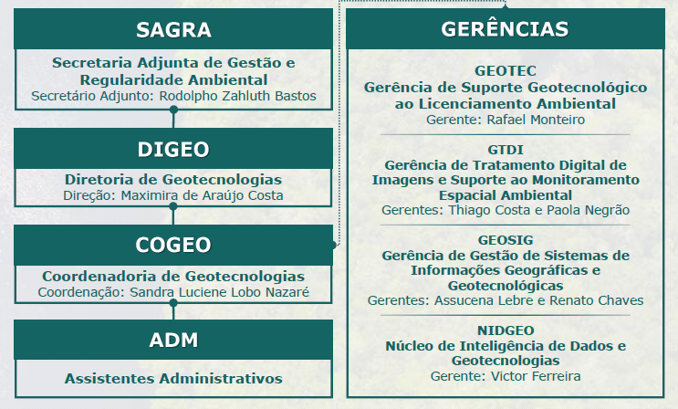

# Diretoria de Geotecnologias - DIGEO

A Diretoria de Geotecnologias (DIGEO) é uma unidade administrativa da **Secretaria de Estado de Meio Ambiente e Sustentabilidade (SEMAS)** do estado do Pará, Brasil. A DIGEO tem como competência coordenar e promover a implementação de programas, projetos e ações relacionados à geotecnologia e sensoriamento remoto, com o objetivo de dar suporte à gestão ambiental do estado.

Além disso, a DIGEO tem como missão apoiar a regularização ambiental por meio da análise e validação do **Cadastro Ambiental Rural (CAR)** e do **Licenciamento Ambiental Rural (LAR)**, com ênfase na inclusão de agricultores familiares, ribeirinhos, extrativistas e comunidades tradicionais. A diretoria conta com uma assessoria técnica que oferece suporte às atividades e ações relacionadas ao CAR, treinamentos e capacitações, além de projetos como o **Paisagens Sustentáveis da Amazônia** e o **REDD+**.

## Gerências da DIGEO

### GEOTEC
A GEOTEC é responsável pela elaboração e disponibilização de produtos cartográficos sistemáticos e temáticos, para sistematização e alimentação do Banco de Dados único da SEMAS, objetivando o atendimento das demandas internas e externas, além da análise e validação de dados georreferenciados dos imóveis apresentados no CAR e submetidos ao licenciamento ambiental.

### GEOSIG
A GEOSIG foi criada com a finalidade de dar suporte geotecnológico aos técnicos da diretoria, sobretudo aos técnicos da GEOTEC que atuam na análise do licenciamento ambiental, assim como produzir um banco de dados confiável e atualizado.

### GTDI
A GTDI é responsável pela classificação automática e semi-automática de produtos de imagem e vetor, utilizando softwares específicos de Tratamento Digital de Imagens e Classificação da Cobertura Vegetal e de Uso do Solo, além da detecção de exploração florestal em série histórica para atender às análises espaciais do licenciamento, monitoramento e fiscalização.

### NIDGEO
Cabe ao Núcleo de Inteligência de Dados e Geotecnologias (NIDGEO) integrar as informações geoespaciais através da construção de sistemas e aplicações para melhorar e otimizar as atividades do setor. Além disso, realiza a gestão de banco de dados e análise de informações geográficas e estatísticas para a geração de relatórios mensais de análise de CAR no estado e disponibilização de relatórios e dados geoespaciais ao público.

---

## Projetos

### Sistema de Certificação de Cadastro Ambiental Rural (CAR)

O **Sistema de Certificação de Cadastro Ambiental Rural (CAR)** é um aplicativo desenvolvido pelo NIDGEO para automatizar e otimizar a emissão de certificados de CAR. Este sistema possui os seguintes destaques:

- **Automação de Processos**: Geração de certificados em massa a partir de listas ou buscas por CPF/CNPJ.
- **Eficiência Operacional**: Redução significativa do tempo necessário para emissão e controle dos certificados.
- **Análise e Validação**: Integração com bases de dados existentes para validação de dados em tempo real.
- **Painel de Monitoramento**: Dashboard interativo que exibe métricas em tempo real, como número de certificados emitidos e área regularizada.
- **Relatórios Automatizados**: Geração de relatórios de metadados detalhados sobre os certificados emitidos.

Acesse o repositório do projeto para mais informações: [Sistema de Certificação CAR](https://github.com/nidgeo-digeo-semas/certificacao-car)
