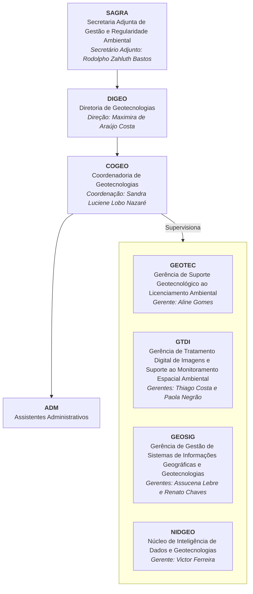

# Diretoria de Geotecnologias - DIGEO

A Diretoria de Geotecnologias (DIGEO) é uma unidade administrativa da **Secretaria de Estado de Meio Ambiente e Sustentabilidade (SEMAS)** do estado do Pará, Brasil. A DIGEO tem como competência coordenar e promover a implementação de programas, projetos e ações relacionados à geotecnologia e sensoriamento remoto, com o objetivo de dar suporte à gestão ambiental do estado.

Além disso, a DIGEO tem como missão apoiar a regularização ambiental por meio da análise e validação do **Cadastro Ambiental Rural (CAR)** e do **Licenciamento Ambiental Rural (LAR)**, com ênfase na inclusão de agricultores familiares, ribeirinhos, extrativistas e comunidades tradicionais. A diretoria conta com uma assessoria técnica que oferece suporte às atividades e ações relacionadas ao CAR, treinamentos e capacitações, além de projetos como o **Paisagens Sustentáveis da Amazônia** e o **REDD+**.

## Gerências da DIGEO

### GEOTEC
A GEOTEC é responsável pela elaboração e disponibilização de produtos cartográficos sistemáticos e temáticos, para sistematização e alimentação do Banco de Dados único da SEMAS, objetivando o atendimento das demandas internas e externas, além da análise e validação de dados georreferenciados dos imóveis apresentados no CAR e submetidos ao licenciamento ambiental.

### GEOSIG
A GEOSIG foi criada com a finalidade de dar suporte geotecnológico aos técnicos da diretoria, sobretudo aos técnicos da GEOTEC que atuam na análise do licenciamento ambiental, assim como produzir um banco de dados confiável e atualizado.

### GTDI
A GTDI é responsável pela classificação automática e semi-automática de produtos de imagem e vetor, utilizando softwares específicos de Tratamento Digital de Imagens e Classificação da Cobertura Vegetal e de Uso do Solo, além da detecção de exploração florestal em série histórica para atender às análises espaciais do licenciamento, monitoramento e fiscalização.

### NIDGEO
O NIDGEO é a unidade responsável pelo desenvolvimento, manutenção e documentação dos sistemas e bancos de dados utilizados pela Diretoria de Geotecnologias (DIGEO). Sua missão é integrar informações geoespaciais, criar aplicações para otimizar as atividades do setor e fornecer suporte técnico especializado em geoprocessamento, estatística e ciência de dados.

---

### **Equipe NIDGEO**
A equipe do NIDGEO é composta por profissionais especializados em banco de dados, estatística, análise de dados e geoprocessamento.

  <table>
    <tr>
      <th>Função</th>
      <th>Nome</th>
      <th>GitHub</th>
    </tr>
    <tr>
      <td><b>Gerência / Banco de Dados</b></td>
      <td>Victor Viegas</td>
      <td>
        
      </td>
    </tr>
    <tr>
      <td><b>Estatística / Data Analysis</b></td>
      <td>Elberth Sales</td>
      <td>
        
      </td>
    </tr>
    <tr>
      <td><b>Geoprocessamento / Data Science</b></td>
      <td>Samuel Santos</td>
      <td>
        
      </td>
    </tr>
  </table>

### **Principais Responsabilidades**
- **Gestão de Banco de Dados**: Administração e otimização do PostgreSQL/PostGIS.
- **Desenvolvimento e Manutenção de Sistemas**: Implementação de soluções para análise geoespacial e integração de dados.
- **Análises Estatísticas e Geoespaciais**: Processamento e interpretação de dados para suporte à gestão ambiental.
- **Documentação e Repositórios**: Manutenção de registros técnicos e gerenciamento de projetos no GitHub.

---

## Projetos

### Sistema de Certificação de Cadastro Ambiental Rural (CAR)

O **Sistema de Certificação de Cadastro Ambiental Rural (CAR)** é um aplicativo desenvolvido pelo NIDGEO para automatizar e otimizar a emissão de certificados de CAR. Este sistema possui os seguintes destaques:

- **Automação de Processos**: Geração de certificados em massa a partir de listas ou buscas por CPF/CNPJ.
- **Eficiência Operacional**: Redução significativa do tempo necessário para emissão e controle dos certificados.
- **Análise e Validação**: Integração com bases de dados existentes para validação de dados em tempo real.
- **Painel de Monitoramento**: Dashboard interativo que exibe métricas em tempo real, como número de certificados emitidos e área regularizada.
- **Relatórios Automatizados**: Geração de relatórios de metadados detalhados sobre os certificados emitidos.

Acesse o repositório do projeto para mais informações: [Sistema de Certificação CAR](https://github.com/nidgeo-digeo-semas/certificacao-car)

Aqui está um resumo sucinto para incluir no seu portfólio:

---

### Cenário Automatizado no QGIS para Análises Geoespaciais

### Resumo do Projeto
Este projeto automatiza a geração de cenários geoespaciais no QGIS, facilitando o trabalho da **Gerência de Tratamento Digital de Imagens e Suporte ao Monitoramento Espacial Ambiental (GTDI)**, da **Diretoria de Geotecnologias (DIGEO)**. Tradicionalmente, a GTDI monta cenários importando bases vetoriais extensas e organizando-as em grupos e subgrupos antes de realizar recortes com buffer de 15 km para análises detalhadas. 

Com este sistema, grande parte dessas etapas são automatizadas, permitindo que a equipe concentre esforços em tarefas analíticas e tomadas de decisão.

### Funcionalidades Principais
- **Cenário Automático de Vetores:** Importa, organiza e estrutura camadas geoespaciais em grupos e subgrupos no QGIS.
- **Clip Automático Base Local:** Filtra um imóvel específico, gera buffers de 15 km e recorta todas as camadas do projeto dentro desse limite.
- **Exportação e Organização Automatizada:** Camadas recortadas são exportadas e organizadas em uma estrutura clara e eficiente.

### Captura de Tela

### Repositório
[Confira o projeto completo no GitHub](https://github.com/nidgeo-digeo-semas/cenario_automatizado_qgis)

---

### Cálculo do Passivo de Reserva Legal no Estado do Pará

### Resumo do Projeto
Este projeto visa estimar o **passivo de Reserva Legal (RL)** no Estado do Pará, auxiliando na compensação e regularização ambiental conforme os requisitos do **Código Florestal (Lei nº 12.651/2012)**. A metodologia considera tipologias vegetais, remanescentes de vegetação nativa e a base do **Cadastro Ambiental Rural (CAR)**, garantindo um mapeamento preciso das áreas deficitárias. Foram utilizadas bases geoespaciais como **MapBiomas, SNIRH/ANA e SICAR**, além de processamento no **PostgreSQL/PostGIS, Python e QGIS 3.34.3**.

O projeto envolveu quatro etapas principais: (i) construção da base de tipologias vegetais, (ii) identificação do remanescente de vegetação nativa em 2008, (iii) processamento da base do CAR e (iv) cruzamento das bases para calcular o passivo de RL. A análise permitiu identificar imóveis rurais com déficits ambientais, considerando restrições como áreas protegidas e corpos d'água.

### Resultado

### Repositório
[Confira o projeto completo no GitHub](https://github.com/nidgeo-digeo-semas/passivo_compensacao)
